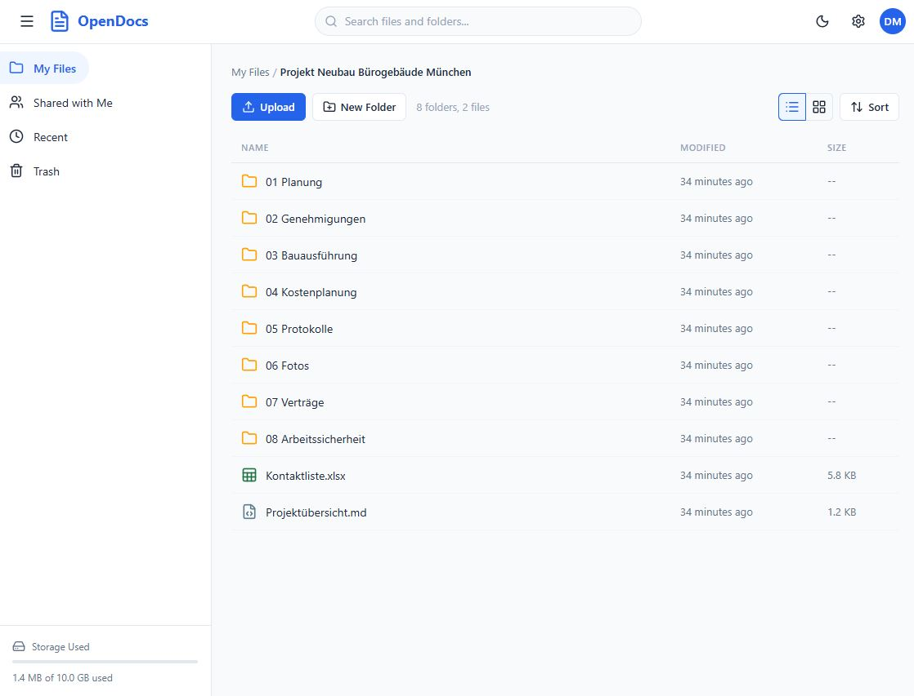
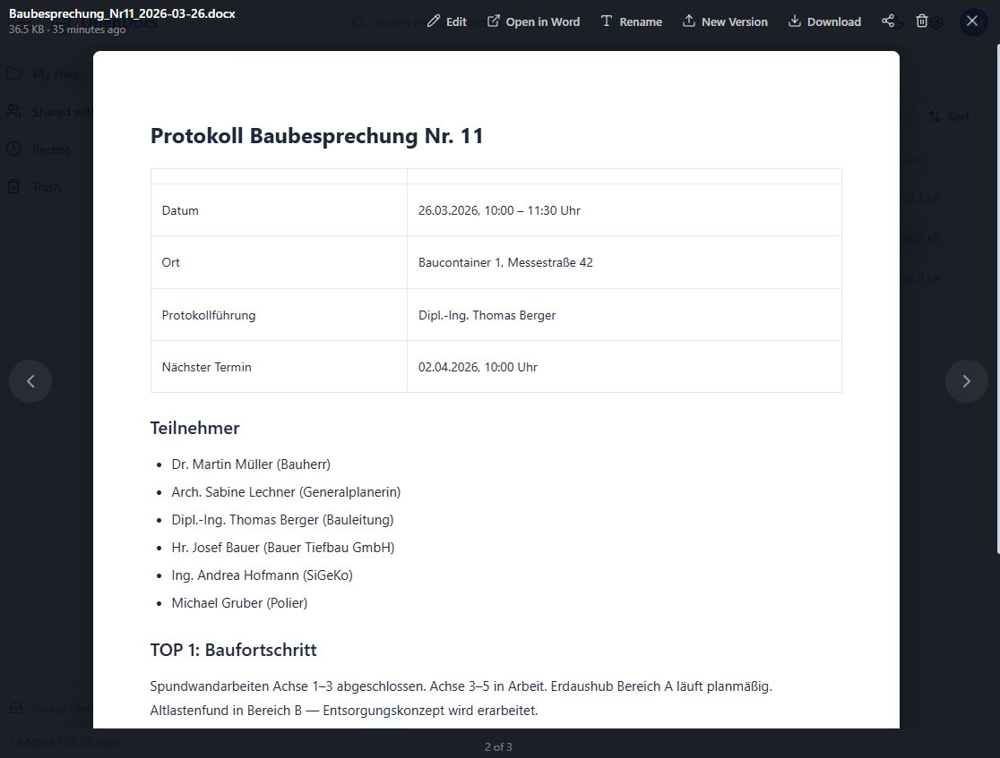
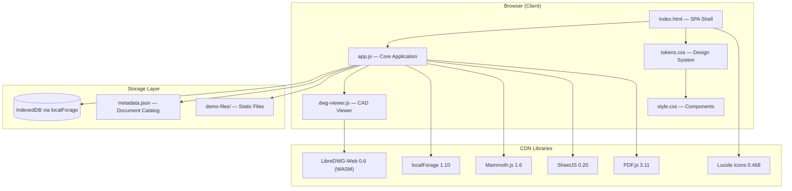
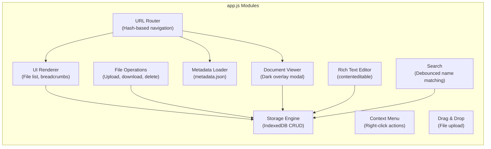

<p align="center">
  
</p>

<h1 align="center">OpenDocs</h1>

<p align="center">
  <strong>Lightweight, open-source document management for construction and engineering teams.</strong><br>
  No build tools. No backend. Pure vanilla JavaScript.
</p>

<p align="center">
  
  
  
  
  
</p>

<p align="center">
  <a href="https://davras5.github.io/open-docs/"><strong>Live Demo</strong></a> &nbsp;&middot;&nbsp;
  <a href="https://github.com/davras5/open-docs">GitHub</a>
</p>

---

## What is OpenDocs?

OpenDocs is a **zero-build, single-page web application** for storing, previewing, sharing, and collaborating on office and construction documents directly in the browser. Think of it as a lightweight, open-source alternative to SharePoint or Google Drive, purpose-built for **construction, architecture, and engineering workflows**.

It runs entirely as static files (HTML + CSS + JS) and can be deployed on **GitHub Pages**, any static host, or served from a local folder. Document storage uses the browser's **IndexedDB** via localForage, with files fetched from a configurable file directory.

> **Status:** This is a working prototype / proof of concept. It demonstrates the UX, document viewing capabilities, and metadata architecture. Production use would require a backend for multi-user access, authentication, and persistent storage.

<p align="center">
  
</p>

---

## Key Features

- **File browser** with grid and list views, folders, breadcrumb navigation, drag-and-drop upload
- **In-browser document preview** for 8+ file formats (see [Supported Formats](#supported-formats))
- **DWG/DXF CAD viewer** with pan, zoom, and full entity rendering via LibreDWG WASM
- **Confluence-style document viewer** with dark overlay, left/right navigation, and image zoom
- **Document metadata** following Dublin Core and construction standards (see [Metadata](#metadata-architecture))
- **URL routing** with shareable links for folders and documents (`/#/d/projektbeschrieb`, `/#/s/pB7xK2`)
- **Search** across file names and metadata
- **Share modal** with copy-to-clipboard short URLs and permission display
- **Dark theme** with full design token system
- **Responsive** layout for desktop, tablet, and mobile
- **Accessible** with WCAG AA focus indicators, proper ARIA, and contrast-compliant colors

---

## Architecture

OpenDocs follows a deliberately simple architecture: no frameworks, no build steps, no server dependencies.



### Application Modules



### File Structure

```
open-docs/
├── index.html              # Single-page application shell
├── css/
│   ├── tokens.css          # Design tokens (CSS custom properties)
│   └── style.css           # Component styles
├── js/
│   ├── app.js              # Core application logic
│   └── dwg-viewer.js       # Standalone DWG/DXF CAD viewer
├── data/
│   └── metadata.json       # Document metadata database
├── demo-files/             # Static demo files (Swiss construction project)
│   ├── 01 Planung/         # .docx, .xlsx, .dwg files
│   ├── 02 Bewilligungen/   # .pdf, .docx files
│   ├── 03-08 .../          # Various office and construction files
│   └── ...
├── assets/                 # README images
└── generate_demo_v2.py     # Python script to regenerate demo files
```

### Design Principles

1. **No build step** -- open `index.html` in a browser and it works. Deploy by copying files.
2. **Read from storage** -- documents and folders are read from a configurable storage layer (currently IndexedDB, designed for file system or S3-compatible backends).
3. **Metadata-driven** -- a structured `metadata.json` defines the document catalog with Dublin Core fields, construction metadata, version history, and sharing information.
4. **Progressive enhancement** -- the app works without any specific library; CDN failures degrade gracefully.
5. **Security by default** -- all external HTML is sanitized. CDN scripts use SRI hashes where supported.

---

## Supported Formats

| Format | Library | Capabilities |
|--------|---------|-------------|
| **.docx** (Word) | [Mammoth.js](https://github.com/mwilliamson/mammoth.js) | Formatted HTML: headings, tables, lists, images |
| **.xlsx** (Excel) | [SheetJS](https://sheetjs.com/) | First sheet as HTML table with headers |
| **.pdf** | [PDF.js](https://mozilla.github.io/pdf.js/) | All pages rendered to canvas, scrollable |
| **.dwg / .dxf** (AutoCAD) | [LibreDWG-Web](https://github.com/nicholasgasior/libredwg-web) (WASM) | Full 2D rendering with 20+ entity types, pan/zoom |
| **.jpg .png .gif .svg .webp** | Native browser | Zoom (scroll, double-click, drag-to-pan) |
| **.md** (Markdown) | Built-in renderer | Headings, tables, lists, code blocks, bold/italic |
| **.txt .json .csv .js .html .css .xml** | Native TextDecoder | Monospace preformatted text |

### DWG/DXF Entity Support

LINE, LWPOLYLINE, POLYLINE2D/3D, CIRCLE, ARC, ELLIPSE, SPLINE, TEXT, MTEXT, ATTRIB, POINT, SOLID, 3DSOLID, TRACE, HATCH (solid fill), DIMENSION (block-based + fallback), LEADER, MLINE, 3DFACE, RAY, XLINE, INSERT (recursive block expansion with OCS extrusion and mirroring).

---

## Metadata Architecture

OpenDocs uses a structured metadata model inspired by established standards:

| Standard | Scope |
|----------|-------|
| [Dublin Core](https://www.dublincore.org/) (ISO 15836) | Title, creator, description, type, language, rights |
| [eCH-0160](https://www.ech.ch/de/der-verein/fachgruppen/records_management) | Swiss records management: classification, retention, access |
| [DCAT](https://www.w3.org/TR/vocab-dcat-3/) (W3C) | Data catalog vocabulary for document discovery |
| SIA 2051 / ISO 19650 | Construction: discipline, SIA phase, revision, status, scale |

### Per-Document Metadata

```json
{
  "id": "doc-001",
  "slug": "projektbeschrieb",
  "shareToken": "pB7xK2",
  "title": "Projektbeschrieb Ueberbauung Seefeld",
  "creator": "Arch. ETH Laura Brunner",
  "description": "Detaillierte Projektbeschreibung...",
  "type": "Bericht",
  "language": "de-CH",
  "rights": "Vertraulich",
  "discipline": "Architektur",
  "phase": "32 Bauprojekt",
  "revision": "2.0",
  "status": "Freigegeben",
  "tags": ["Planung", "Architektur"],
  "versions": [
    { "version": 1, "date": "2025-11-20", "author": "brunner@be-arch.ch", "comment": "Erstversion" }
  ]
}
```

### URL Routing

| URL Pattern | Destination |
|-------------|-------------|
| `/#/` | Root file browser |
| `/#/f/ueberbauung-seefeld/01-planung` | Folder navigation (nested slugs) |
| `/#/d/projektbeschrieb` | Document viewer (by slug) |
| `/#/s/pB7xK2` | Share link (short token) |
| `/#/settings` | Settings view |

All URLs are bookmarkable and shareable. Hash-based routing works on GitHub Pages without server configuration.

---

## Demo Data

The prototype ships with a realistic **Swiss construction project**:

**Ueberbauung Seefeld, Zurich** -- 7-storey mixed-use building, 48 apartments, CHF 62.8M, Minergie-P-ECO.

- 28 documents across 8 folders with full metadata
- Real `.docx` with formatting (python-docx), `.xlsx` with headers (openpyxl), multi-page `.pdf` (fpdf2)
- Real `.dwg` AutoCAD files, construction photos (Unsplash)
- Swiss terminology: BKP costs, SIA phases, VKF fire safety, SIBE

Regenerate: `python generate_demo_v2.py` (requires `python-docx`, `openpyxl`, `fpdf2`).

---

## Getting Started

```bash
git clone https://github.com/davras5/open-docs.git
cd open-docs

# No build -- just open it
open index.html

# Or serve locally
npx serve .
```

For **GitHub Pages**: Settings > Pages > Deploy from branch `main`, folder `/` (root).

---

## Design System

Built on a **CSS custom property token system** (`css/tokens.css`):

- Color primitives (Slate-based neutrals) mapped to semantic tokens
- Dark theme via token reassignment (single `.dark-theme` class)
- 7-step typography scale (rem-based)
- 4px-base spacing scale (12 steps)
- 5 elevation levels, 3 motion durations
- WCAG AA compliant: 40px touch targets, 4.5:1 contrast ratios

---

## Roadmap

### Currently Missing

- **Document versioning & backup** -- metadata schema supports it; needs backend storage for binary diffs
- **IAM (Identity & Access Management)** -- no authentication; hardcoded mock user
- **Multi-user collaboration** -- single-browser only; no real-time sync

### Feature Considerations

| Feature | Complexity | Notes |
|---------|-----------|-------|
| Document versioning & history | Medium | Version metadata exists; needs diff storage backend |
| Comments & annotations | Medium | Per-document threads, PDF annotation layers |
| IAM & role management | High | Per-folder/document permissions, audit trail |
| Third-party IAM (OAuth2/OIDC) | High | Azure AD, Keycloak, Auth0 |
| i18n / multi-language | Medium | Externalize UI strings, language switcher |
| Improved search & indexing | High | Full-text index (Meilisearch), faceted filters, tag search |
| REST / GraphQL API | High | Document CRUD, metadata management, file upload |
| Storage backends (S3, WebDAV) | Medium | Replace IndexedDB with server-side storage |
| Multi-tenant / project management | High | Tenant isolation, project-level access |
| Backend automation | Medium | Webhooks, approval workflows |
| Automatic metadata extraction | Medium | Parse Office metadata, classify by content |
| RAG (Retrieval-Augmented Generation) | High | Vector embeddings of documents for LLM-powered Q&A |
| Live collaborative editing | Very High | CRDT (Yjs) or OT; requires WebSocket server |
| IFC viewer (BIM models) | High | Server-side conversion for large files; IFC.js / Three.js |
| Point cloud viewer (.las/.laz) | High | Potree; needs backend tiling for large scans |
| 360-degree photo viewer | Medium | Pannellum; feasible client-side |
| Office tool plugins | Medium | Microsoft 365 / Google Workspace add-ins |
| Windows folder sync plugin | Medium | Desktop tray app or shell extension to sync a local folder with OpenDocs |
| Wiki & project management | Very High | Kanban, backlog, issues, markdown wiki |
| PDF annotation & markup | Medium | Draw, highlight, comment as separate layer |
| Offline-first with sync | High | Service Worker + CRDTs for eventual consistency |
| Audit trail & compliance | Medium | eCH-0160 / ISO 15489 access logging |

---

## Security

- **HTML sanitization** -- external HTML from document renderers is sanitized (strips scripts, iframes, event handlers)
- **SRI hashes** -- CDN scripts pinned with Subresource Integrity where supported
- **XSS escaping** -- user-facing strings use `textContent` assignment or `_esc()` helpers
- **Client-side only** -- no server attack surface, but also no authentication

---

## Tech Stack

| Layer | Technology |
|-------|-----------|
| UI | Vanilla HTML5, CSS3, JavaScript (ES2017+) |
| Icons | [Lucide](https://lucide.dev/) 0.468.0 |
| Storage | [localForage](https://localforage.github.io/localForage/) 1.10.0 (IndexedDB) |
| Word preview | [Mammoth.js](https://github.com/mwilliamson/mammoth.js) 1.6.0 |
| Excel preview | [SheetJS](https://sheetjs.com/) 0.20.1 |
| PDF preview | [PDF.js](https://mozilla.github.io/pdf.js/) 3.11.174 |
| CAD preview | [LibreDWG-Web](https://github.com/nicholasgasior/libredwg-web) 0.6.6 (WASM) |
| Design system | CSS custom properties (tokens.css) |
| Deployment | GitHub Pages (static files) |

---

## License

[MIT](LICENSE)

---

<p align="center">
  <sub>Built with vanilla JS and open-source libraries. No frameworks were harmed.</sub>
</p>
